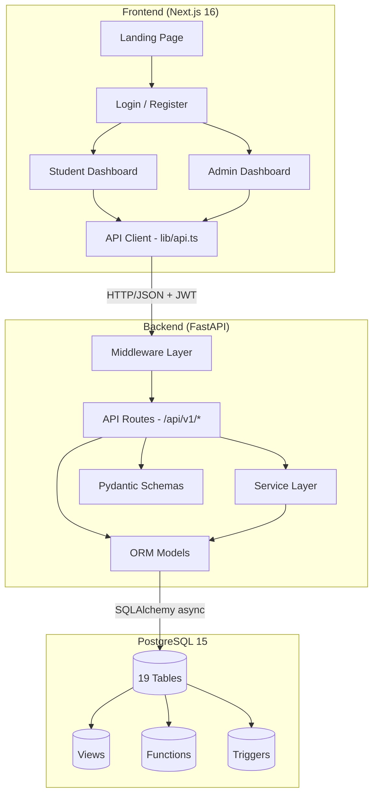
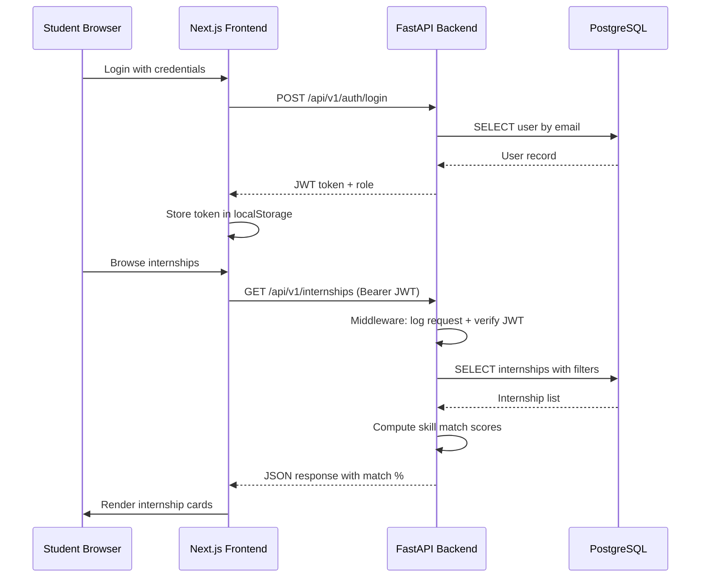

# 🏗️ System Architecture

InternTrack follows a **3-tier architecture** with clear separation between presentation, business logic, and data layers.

## Component Diagram

## Layer Responsibilities

### Frontend (Presentation Layer)
| Component | Responsibility |
|-----------|---------------|
| `app/` | Next.js App Router pages (landing, login, register, student, admin) |
| `components/` | Tab-based UI components for student and admin portals |
| `lib/api.ts` | Centralized API client with JWT auth headers |
| `lib/toast.ts` | User feedback notifications |
| `lib/dates.ts` | Date formatting utilities |
| `lib/types.ts` | Shared TypeScript interfaces |

### Database Resilience & Connection Pooling
- PostgreSQL connection pooling managed asynchronously via SQLAlchemy 2.0 and `asyncpg`.
- Configured connection recycling and max overflow safeguards for high concurrency.

### Backend (Business Logic Layer)
| Component | Responsibility |
|-----------|---------------|
| `api/v1/` | 12 REST API route modules (auth, students, companies, etc.) |
| `core/` | Config, security (JWT/bcrypt), CORS, response wrappers |
| `services/` | Skill matching engine, email service, status transitions, file validation |
| `middleware/` | Request logging with response time tracking |
| `models/` | 19 SQLAlchemy ORM models with relationships |
| `schemas/` | Pydantic v2 request/response validation schemas |

### Database (Data Layer)
| Component | Responsibility |
|-----------|---------------|
| `schema.sql` | 19 normalized tables (3NF) |
| `constraints.sql` | Foreign keys, CHECK constraints, UNIQUE constraints |
| `indexes.sql` | B-tree indexes for query optimization |
| `triggers.sql` | Audit logging, status history tracking |
| `functions.sql` | Profile completion calculation, upcoming deadlines |
| `views.sql` | Pre-computed placement dashboard summaries |

## Data Flow

## Security Architecture

- **Authentication**: JWT tokens with HS256 signing, configurable expiry
- **Password Storage**: bcrypt hashing with random salt
- **Authorization**: Role-based (student/admin) via JWT claims
- **CORS**: Configurable origin whitelist
- **Rate Limiting**: In-memory per-email login throttle (5 attempts/60s)
- **File Upload**: Extension whitelist + magic byte validation + 5MB size cap
- **SQL Injection**: SQLAlchemy ORM parameterized queries throughout
- **Error Handling**: Sanitized error responses (no stack traces in production)
