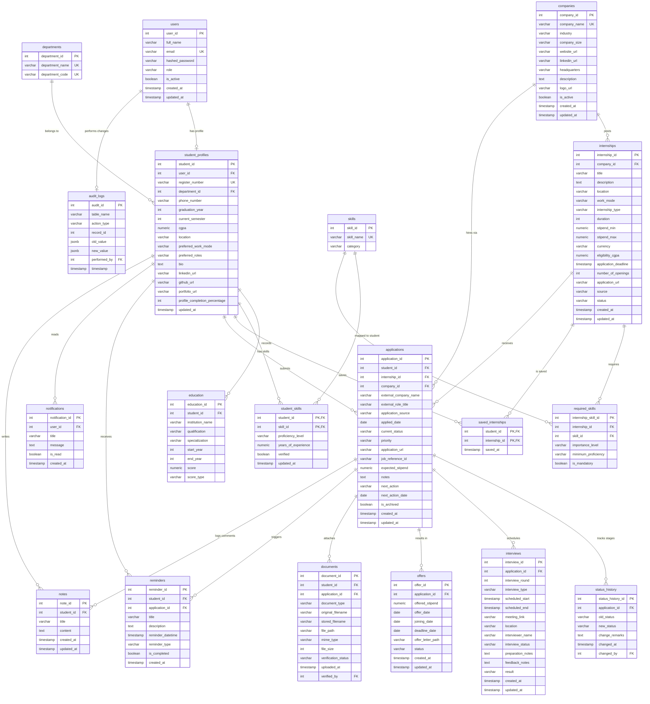

# InternTrack Entity-Relationship (ER) Diagram

This document contains the complete database ER diagram representing the **InternTrack** relational schema, implemented using Mermaid notation.

## Mermaid Entity-Relationship Diagram

